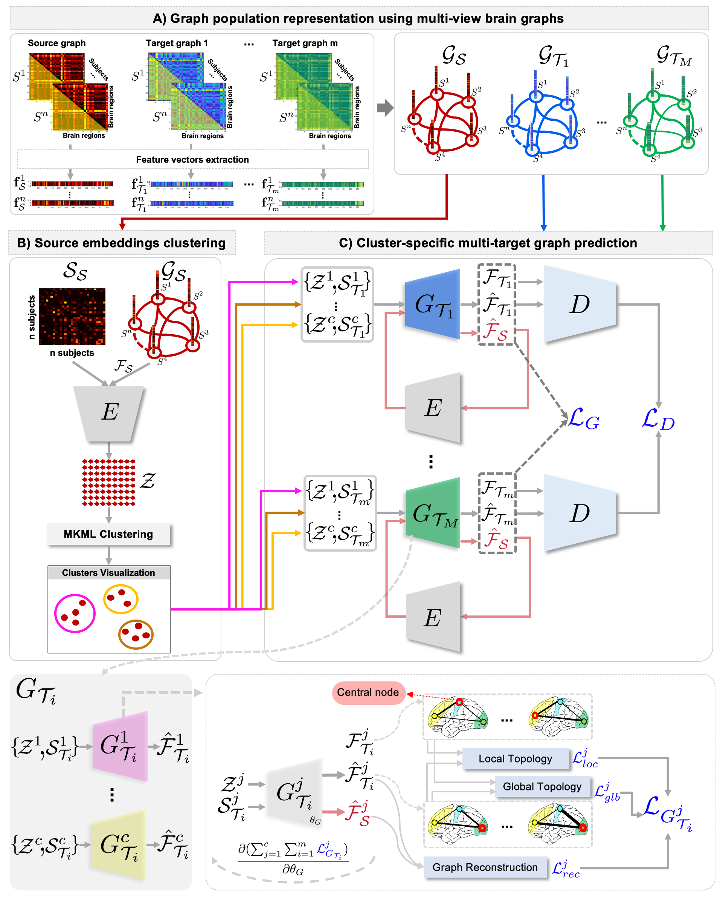
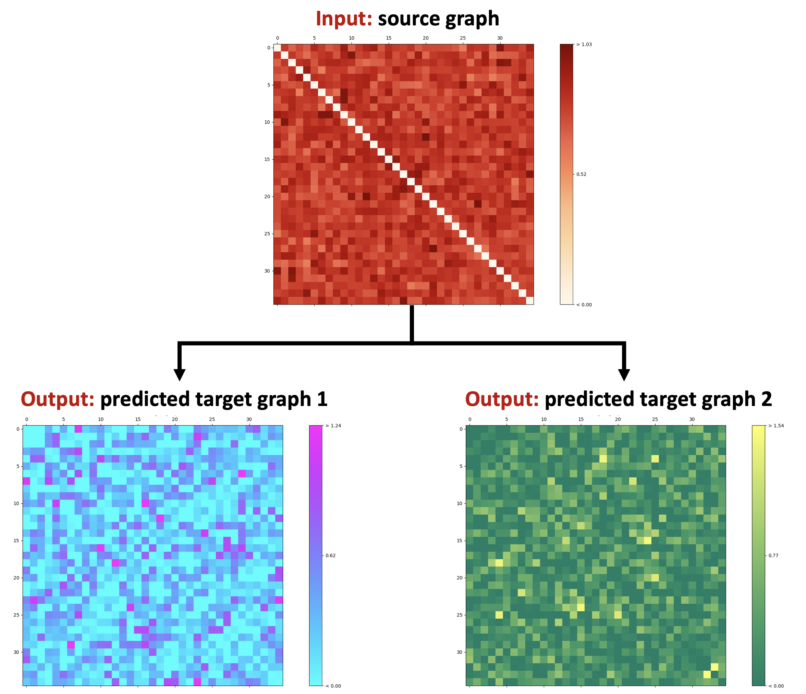

# MultiGraphGAN
MultiGraphGAN for jointly predicting multiple brain graphs from a single brain graph, coded up in Python by Alaa Bessadok. Please contact alaa.bessadok@gmail.Com for further inquiries. Thanks. 

This repository provides the official PyTorch implementation of the following paper:

<p align="center">
  
</p>


> **Topology-Aware Generative Adversarial Network for Joint Prediction of Multiple Brain Graphs from a Single Brain Graph**
> [Alaa Bessadok](https://github.com/AlaaBessadok)<sup>1,2</sup>, [Mohamed Ali Mahjoub]<sup>2</sup>, [Islem Rekik](https://basira-lab.com/)<sup>1</sup>
> <sup>1</sup>BASIRA Lab, Faculty of Computer and Informatics, Istanbul Technical University, Istanbul, Turkey
> <sup>2</sup>University of Sousse, Higher Institute of Informatics and Communication Technologies, Sousse, Tunisia
>
> **Abstract:** *Multimodal medical datasets with incomplete observations present a barrier to large-scale neuroscience studies. Several works based on Generative Adversarial Networks (GAN) have been recently proposed to predict a set of medical images from a single modality (e.g, FLAIR
MRI from T1 MRI). However, such frameworks are primarily designed to operate on images, limiting their generalizability to non-Euclidean geometric data such as brain graphs. While a growing number of connectomic studies has demonstrated the promise of including brain graphs for diagnosing neurological disorders, no geometric deep learning work was designed for multiple target brain graphs prediction from a source brain graph. Despite the momentum the field of graph generation has gained
in the last two years, existing works have two critical drawbacks. First, the bulk of such works aims to learn one model for each target domain to generate from a source domain. Thus, they have a limited scalability in jointly predicting multiple target domains. Second, they merely consider the global topological scale of a graph (i.e., graph connectivity structure) and overlook the local topology at the node scale of a graph (e.g., how central a node is in the graph). To meet these challenges, we introduce MultiGraphGAN architecture, which not only predicts multiple brain graphs from a single brain graph but also preserves the topological structure of each target graph to predict. Its three core contributions lie in: (i) designing a graph adversarial auto-encoder for jointly predicting brain graphs from a single one, (ii) handling the mode collapse problem of GAN by clustering the encoded source graphs and proposing a cluster-specific decoder, (iii) introducing a topological loss to force the reconstruction of topologically sound target brain graphs. Our MultiGraphGAN significantly outperformed its variants thereby showing its great potential in multi-view brain graph generation from a single graph. Our code is available at https://github.com/basiralab/MultiGraphGAN.*

This work is published in MICCAI 2020, Lima, Peru. MultiGraphGAN is a geometric deep learning framework for jointly predicting multiple brain graphs from a single graph. Using an end-to-end learning fashion, it preserves the topological structure of each target graph. Our MultiGraphGAN framework comprises two key steps (1) source graphs embedding and clustering and, (2) cluster-specific multi-target graph prediction. We have evaluated our method on ABIDE dataset. Detailed information can be found in the original paper and the video in the BASIRA Lab YouTube channel. In this repository, we release the code for training and testing MultiGraphGAN on a simulated dataset.

# Installation

The code has been tested with Python 3, PyTorch 1.3.1 on Ubuntu 16.04. GPU is required to run the code. You also need other dependencies (e.g., numpy, yaml, networkx, SIMLR) which can be installed via: 

```bash
pip install -r requirements.txt
```

# Training and testing MultiGraphGAN

We provide a demo code for the usage of MultiGraphGAN for multiple target graphs prediction from a source graph. In main.py we train MultiGraphGAN on a simulated dataset with 280 subjects and test it on 30 subjects. Each sample has 6 brain graphs (one source graph and five target graphs). In this example, we used three input arguments (i.e., num_domains, nb_clusters and mode), you can add hyper-parameters (e.g., lambda_topology, lambda_rec) and vary their default values.

You can train the program with the following command:

```bash
python main.py --num_domains=6 --nb_clusters=2 --mode='train'
```

In this example, we simulated a training dataset with 280 samples and a testing set with 30 samples. If you want to test the code using the hyperparameters described in the paper, type in the terminal the following commande:

```bash
python main.py --num_domains=6 --nb_clusters=2 --mode='test'
```

# Input data

In order to use our framework, you need to provide:

* a source_target_domains list where each element is a matrix of size (n * f). We denote n the total number of subjects in the dataset and f the number of features. Any element of the list can be considered as the source domain and the rest are the target domains. You need to include your data in the file main.py. So, just remove our simulated training and testing dataset and replace it with yours.

# Output Data

If you set the number of source and target domains to 3 using this argument --num_domains=3 , and keep the same size of our simulated data, the execution of main.py will produce saved csv files of the source and target data. Then, you can plot the brain graphs of any subject from the saved csv files. To do so, run the plot.py to get the following outputs especially when running the demo with default parameter setting:

<p align="center">
  
</p>

# YouTube videos to install and run the code and understand how MultiGraphGAN works

To install and run MultiGraphGAN, check the following YouTube video:

https://youtu.be/JvT5XtAgbUk

To learn about how MultiGraphGAN works, check the following YouTube videos:

Short version (10mn): https://youtu.be/vEnzMQqbdHc

Long version (20mn): https://youtu.be/yNx7H9NLzlE

# Related references

Multi-Marginal Wasserstein GAN (MWGAN): 
Cao, J., Mo, L., Zhang, Y., Jia, K., Shen, C., Tan, M.: Multi-marginal wasserstein gan. [https://arxiv.org/pdf/1911.00888.pdf] (2019) [https://github.com/caojiezhang/MWGAN].

Single‐cell Interpretation via Multi‐kernel LeaRning (SIMLR):
Wang, B., Ramazzotti, D., De Sano, L., Zhu, J., Pierson, E., Batzoglou, S.: SIMLR: a tool for large-scale single-cell analysis by multi-kernel learning. [https://www.biorxiv.org/content/10.1101/052225v3] (2017) [https://github.com/bowang87/SIMLR_PY].


# Citation

If our code is useful for your work please cite our paper:

```latex
@inproceedings{bessadok2020,
title={Topology-Aware Generative Adversarial Network for Joint Prediction of Multiple Brain Graphs from a Single Brain Graph},
author={Bessadok, Alaa and Mahjoub, Mohamed Ali and Rekik, Islem},
booktitle={ International Conference on Medical Image Computing and Computer Assisted Intervention},
year={2020},
organization={Springer}
}
```

# MultiGraphGAN on arXiv

https://arxiv.org/abs/2009.11058

# Acknowledgement

This project has been funded by the 2232 International Fellowship for Outstanding Researchers Program of TUBITAK (Project No:118C288, http://basira-lab.com/reprime/) supporting Dr. Islem Rekik. However, all scientific contributions made in this project are owned and approved solely by the authors.

# License
Our code is released under MIT License (see LICENSE file for details).


